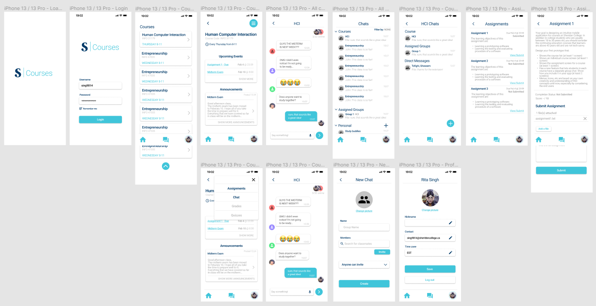
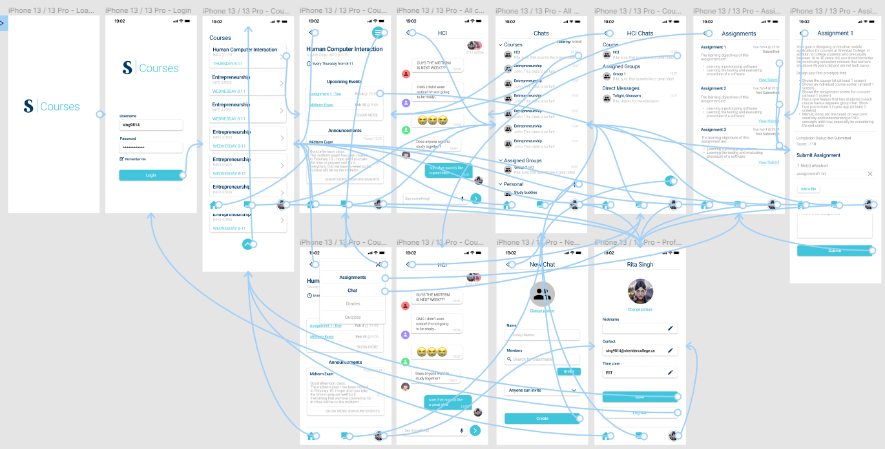

# SheridanCourses

## About

An intuitive mobile application for courses at Sheridan College. It is designed for students who are usually between 18 to 30 years old, while also considering the continuing education courses that are above 45 years old and are not tech savvy.

## Features

- Log in with student username and password
- View course list and individual courses
- View and submit assignments
- Voice to text messaging
- Course and assigned group chats
- Create your own personal group chat
- Edit profile
- Time zone setting (made for international students)

## Prototype

## Navigation Prototype

## Future Planning

Custom schedule planner: Students Can plan ahead what they need to get done each day. This would help students stay organized and ensure they don’t wait until the last minute to get things done.

Course timeline: Have an archived timeline where users can view all the courses that they’ve already taken along with their submitted work and grades. 

Quizzes: Allow students to write their quizzes within the Sheridan Courses app using lockdown browser and/or respondus when needed. Also, allow students to make their own quizzes so they can test themselves on course material.

Grades: Allow students to view their grades as well as a class grade distribution graph to visually show the student how they scored in comparison to their classmates. If they scored in the lower half of the class the app should recommend tips on how to study better for that subject/link to a tutoring service.

Notification settings: Allow the user to choose which notifications they want to see. Also, allow the user to set a reminder notification for an upcoming due date/assessment when they would like to receive it (1 hour before, 1 day before, 2 days before, etc)

## Links

[Figma](https://www.figma.com/file/MiJlNKymeksMOW6uftGrtv/Assignment2?node-id=0%3A1)
[Video](https://youtu.be/dQw4w9WgXcQ)
